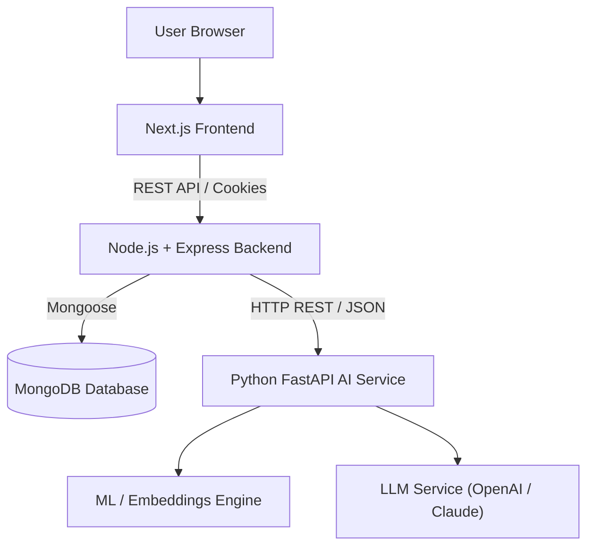

# 01 - System Architecture

## 1. System High-Level Topology



## 2. Layered Backend Architecture

The Node.js backend adheres strictly to a clean 3-tier architecture:

```
[ HTTP Requests ]
       │
       ▼
┌──────────────────┐
│   Routes Layer   │  - URL Routing & Middleware Binding (Auth, Validation)
└────────┬─────────┘
         │
         ▼
┌──────────────────┐
│ Controller Layer │  - HTTP Request/Response handling, DTO mapping
└────────┬─────────┘
         │
         ▼
┌──────────────────┐
│  Service Layer   │  - Business logic, Orchestration, AI Service Bridge
└────────┬─────────┘
         │
    ┌────┴──────────────┐
    ▼                   ▼
┌──────────────┐  ┌──────────────┐
│ Mongoose     │  │ AI Service   │
│ Models (DB)  │  │ (HTTP REST)  │
└──────────────┘  └──────────────┘
```

## 3. Key Design Decisions

1. **Decoupled AI Microservice**: Express handles authentication, authorization, persistence, validation, and dashboard aggregation. Python handles ML calculations, embeddings, and LLM orchestration.
2. **AI Mock Mode (`AI_MOCK_MODE=true`)**: Allows complete offline development and frontend testing without requiring Python running locally.
3. **HTTP-Only Cookies & Dual Token JWT**: Protects tokens from XSS attacks while ensuring seamless session renewal via refresh tokens.
4. **Unified Error & Response Format**: Standardized `ApiResponse` and `ApiError` format across all endpoints for maximum client predictability.
