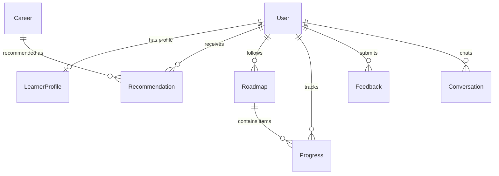

# 02 - Database Design & Schema Specifications

## 1. Overview

CAREER PATHFINDER uses MongoDB with Mongoose object modeling. Collections and relationships are indexed for optimal query performance.

## 2. Collections Overview & ER Diagram

## 3. Schema Definitions

### User Collection (`users`)
- `_id`: ObjectId (Primary Key)
- `name`: String (Required, trimmed, min 2 chars)
- `email`: String (Required, unique, lowercase, indexed)
- `password`: String (Required, min 6 chars, hidden by default `select: false`)
- `role`: String (Enum: `user`, `admin`, default `user`)
- `avatar`: String (Optional URL)
- `createdAt`, `updatedAt`: Timestamps

### LearnerProfile Collection (`learnerprofiles`)
- `_id`: ObjectId
- `userId`: ObjectId (Ref `User`, unique, indexed)
- `education`: String
- `educationLevel`: String (e.g., Bachelor, Master, Self-Taught)
- `experienceLevel`: String (Beginner, Intermediate, Advanced)
- `currentRole`: String
- `targetCareer`: String
- `skills`: Array[String]
- `interests`: Array[String]
- `careerGoals`: Array[String]
- `learningPreferences`: Array[String]
- `preferredLearningStyle`: String
- `weeklyLearningHours`: Number (1 to 168)
- `completedCourses`: Array[{ title, platform, completionDate, url }]
- `certifications`: Array[{ title, issuer, issueDate, credentialUrl }]
- `projects`: Array[{ title, description, repoUrl, liveUrl, techStack }]
- `languages`: Array[String]
- `location`: String
- `previousLearningHistory`: String
- `currentKnowledgeLevel`: String
- `createdAt`, `updatedAt`: Timestamps

## 4. Key Indexes
- `users`: `{ email: 1 }` (unique)
- `learnerprofiles`: `{ userId: 1 }` (unique)
