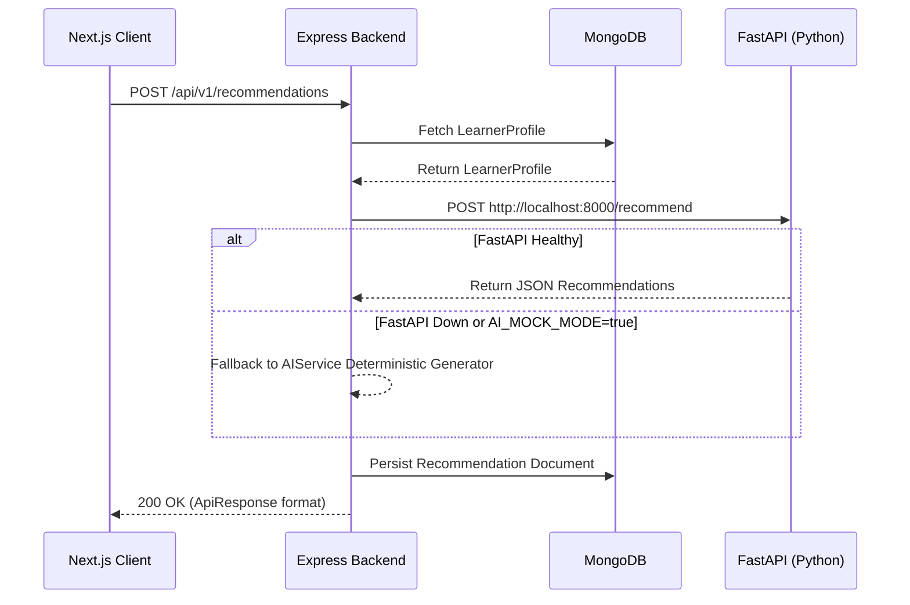

# 06 - AI Service Integration Architecture

## 1. Architecture Overview

The Node.js Express backend serves as the orchestration gateway between the Next.js client and the Python FastAPI microservice:

## 2. API Microservice Endpoints Exposed by Python FastAPI

- `POST /recommend`: Calculates candidate career matches with confidence and skill gaps.
- `POST /skill-gap`: Performs granular matrix comparison between learner skills and career requirements.
- `POST /roadmap`: Generates multi-phase milestone roadmaps.
- `POST /adapt`: Re-evaluates learning trajectories based on completed milestones & user ratings.
- `POST /assistant`: Processes user queries with career context and outputs suggested actions.
- `GET /health`: Health check status endpoint.

## 3. Resilience & Failure Handling

1. **Timeout Control**: Requests to FastAPI enforce `AI_SERVICE_TIMEOUT` (30,000 ms).
2. **Fallback Mock Mode**: If `AI_MOCK_MODE=true` OR if connection to Python drops, `AIService` transparently returns structured mock data without breaking the application or crashing Express.
3. **No Direct Python Code Execution**: Express never executes child processes or Python scripts directly, adhering strictly to microservice boundaries.
